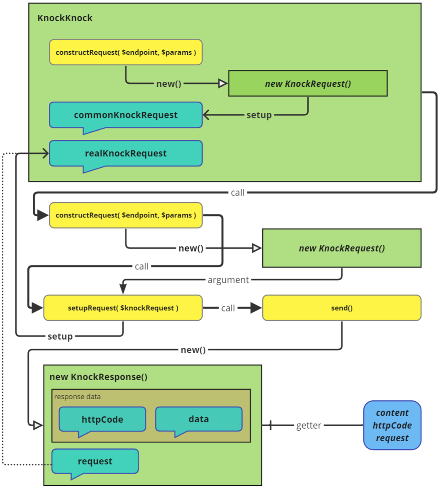

# Вводная.

Репозиторий содержит 3 класса, применяющих паттерн Фасад,  
для реализации оправки запроса через php расширение cURL.

Цель: сделать простой и лёгкий в настройке пакет для реализации разных API на его основе.

Я знаю про существование таких библиотек как: [Guzzle](https://github.com/guzzle/guzzle), [Client](https://github.com/yiisoft/yii2-httpclient) _(в моём любимом Yii2)_, но хотелось попробовать создать свою реализацию.
Без "лишних" данных, вызовов и настроек - только то, что нужно. Разумеется, это не конкурент, а просто попытка создать что-то своё.

### Требования:
 - php 8.0
 - ext cURL
 - ext JSON

<p align="center">- - - - -</p>

<h1 align="center">Установка</h1>

### Git

В файл вашего проекта `composer.json` добавьте:  
 в раздел `require`  строку `"andy87/knockknock": "dev-master"`  
 в раздел `repositories`  
```
{
    "type": "vcs",
    "url": "https://github.com/andy87/KnockKnock"
}
```
Выполните команду: `composer update`.  
Возможно придётся так же добавить в корень данных `composer.json`  
`"minimum-stability": "dev"`

### Composer.

Установка через [composer](https://getcomposer.org/download/)

#### Консольные команды.
_предпочтительней:_  
composer: `composer require andy87/KnockKnock`   
composer.phar: `php composer.phar require andy87/KnockKnock`  

#### Вручную.
Добавьте в раздел `require` вашего `composer.json` файла строку

`"andy87/KnockKnock": "*"`

После выполните команду:  
composer: `composer update`  
composer.phar: `php composer.phar update`  

<p align="center"> - - - - - </p>

<h1 align="center">KnockKnock</h1>

<p align="center"></p>

### Условная схема работы приложения

<p align="center"></p>

## Базовый класс: 
_use [andy87\knock_knock\core\KnockKnock](src/core/KnockKnock.php);_  

PHP Фасад\Адаптер для отправки запросов через ext cURL

### ReadOnly свойства:
- host - хост
- commonKnockRequest - объект, содержащий данные запроса, назначаемые всем исходящим запросам
- realKnockRequest - объект текущего запроса
- logs - логи
- eventHandlers - события

Возможности/фичи:
 - Настройка параметров запросов
   - см. `Полный список констант`
 - Обработчики событий
   - см. `Список событий`
 - доступна возможность использовать Singleton
 - применяется инкапсуляция
 - защита данных от перезаписи

### ВАЖНЫЙ МОМЕНТ!
`CURL_OPTIONS` по умолчанию пустые! В большинстве случаев требуется задать необходимые настройки для получения валидных ответов.  
См. пример ниже.

В классах применяется инкапсуляция, поэтому для доступа к свойствам компонентов необходимо использовать сеттеры и геттеры.

## Получение объекта/экземпляра класса и его настройка

Передавая параметры напрямую в конструктор:
```php
// настройки для отправки запросов
$knockKnockParams = [
    KnockRequestInterface::SETUP_PROTOCO => $_ENV['API_PROTOCOL'],
    KnockRequestInterface::SETUP_CONTENT_TYPE => KnockRequest::CONTENT_TYPE_JSON,
    KnockRequestInterface::SETUP_CURL_OPTIONS => [
        CURLOPT_HEADER => false,
        CURLOPT_RETURNTRANSFER => true
    ]
];
// Получаем компонент для отправки запросов
$knockKnock = new KnockKnock( $_ENV['API_HOST'], $knockKnockParams );
``` 
Применяя, паттерн Singleton:
```php
$knockKnock = KnockKnock::getInstance( $_ENV['API_HOST'], $knockKnockParams );
```
Оба вызова вернут объект/экземпляр класса `KnockKnock` и принимают на вход два аргумента:
- `string $host` - хост
- `array $knockKnockConfig` - массив с настройками, ключами которого являются константы класса `KnockRequest` имеющие префикс `SETUP_`.  
#### Полный список констант:
- `SETUP_PROTOCOL`
- `SETUP_HOST`
- `SETUP_URL`
- `SETUP_METHOD`
- `SETUP_HEADERS`
- `SETUP_CONTENT_TYPE`
- `SETUP_DATA`
- `SETUP_CURL_OPTIONS`
- `SETUP_CURL_INFO`

После создания объекта `KnockKnock` вызывается метод `init()`, который инициализирует объект  
и вызывается callback функция, прикреплённая к событию `EVENT_AFTER_CONSTRUCT`

## Обработчики событий

### Список событий
- `EVENT_AFTER_CONSTRUCT` после создания объекта knockKnock
- `EVENT_CREATE_REQUEST` после создания объекта запроса
- `EVENT_BEFORE_SEND` перед отправкой запроса
- `EVENT_CURL_HANDLER` перед отправкой curl запроса
- `EVENT_CREATE_RESPONSE` после создания объекта ответа
- `EVENT_AFTER_SEND` после получения ответа

##### Пример установки обработчиков событий
```php
$knockKnock->setupEventHandlers([
    KnockKnock::EVENT_AFTER_CONSTRUCT => fn( static $knockKnock ) => {
        // создание объекта knockKnock, для взаимодействия с $knockKnock
    },
    KnockKnock::EVENT_CREATE_REQUEST => fn( static $knockKnock, KnockRequest $knockRequest ) => {
        // создание объекта запроса, для взаимодействия с $knockRequest
    },
    KnockKnock::EVENT_BEFORE_SEND => fn(  static $knockKnock, KnockRequest $knockRequest ) => {
        // отправка запроса, для взаимодействия с $knockRequest
    },
    KnockKnock::EVENT_CURL_HANDLER => fn( static $knockKnock, resource $ch ) => {
        // перед отправкой curl запроса, для взаимодействия с $ch
    },
    KnockKnock::EVENT_CREATE_RESPONSE => fn( static $knockKnock, KnockResponse $knockResponse ) => {
        // создание объекта ответа, для взаимодействия с $knockResponse
    },
    KnockKnock::EVENT_AFTER_SEND => fn( static $knockKnock, KnockResponse $knockResponse ) => {
        // получение ответа, для взаимодействия с $knockResponse
    }
]);
```
Первый аргумент - ключ события, второй - callback функция.

Все callback функции принимают первым аргументом объект/экземпляр класса `KnockKnock`.  
Вторым аргументом передаётся объект/экземпляр класса в зависимости от события:
- `KnockRequest` - для событий `EVENT_CREATE_REQUEST`, `EVENT_BEFORE_SEND`
- `KnockResponse` - для событий `EVENT_CREATE_RESPONSE`, `EVENT_AFTER_SEND`

<p align="center">- - - - -</p>

<h1 align="center">Запрос</h1>

_use [andy87\knock_knock\core\KnockRequest](src/core/KnockRequest.php);_  

Объект запроса, содержащий данные для отправки запроса.

### ReadOnly свойства:
- protocol - протокол
- host - хост
- endpoint - конечная точка
- method - метод
- headers - заголовки
- contentType - тип контента
- data - данные
- curlOptions - опции cURL
- curlInfo - информация cURL
- params - параметры запроса
- url - полный URL
- params - все Read-only свойства в виде массива

### Создание объекта запроса

Передавая параметры напрямую в конструктор:
```php
$knockRequest = new KnockRequest( 'info/me', [
    KnockRequest::METHOD => LibKnockMethod::POST,
    KnockRequest::DATA => [ 'client_id' => 34 ],
    KnockRequest::HEADERS => [ 'api-secret-key' => $_ENV['API_SECRET_KEY'] ],
    KnockRequest::CURL_OPTIONS => [ CURLOPT_TIMEOUT => 10 ],
    KnockRequest::CURL_INFO => [
        CURLINFO_CONTENT_TYPE,
        CURLINFO_HEADER_SIZE,
        CURLINFO_TOTAL_TIME
    ],
    KnockRequest::CONTENT_TYPE => LibKnockContentType::FORM_DATA,
]);
```
Методом, который вызывает _callback_ функцию, привязанную к ключу `EVENT_CREATE_REQUEST`
```php
$knockRequest = $knockKnock->constructKnockRequest( 'info/me', [
    KnockRequest::METHOD => LibKnockMethod::POST,
    KnockRequest::DATA => [ 'client_id' => 45 ],
    KnockRequest::HEADERS => [ 'api-secret-key' => $_ENV['API_SECRET_KEY'] ],
    KnockRequest::CURL_OPTIONS => [ CURLOPT_TIMEOUT => 10 ],
    KnockRequest::CURL_INFO => [
        CURLINFO_CONTENT_TYPE,
        CURLINFO_HEADER_SIZE,
        CURLINFO_TOTAL_TIME
    ],
    KnockRequest::CONTENT_TYPE => LibKnockContentType::FORM_DATA,
]);
```
Клонируя существующий объект запроса:
```php
$knockRequest = $knockKnock->constructKnockRequest( 'info/me' );

$knockResponse = $knockKnock->setupRequest( $knockRequest )->send();

//Клонирование объекта запроса (без статуса отправки)
$cloneKnockRequest = $knockRequest->clone();

// Отправка клона запроса
$knockResponse = $knockKnock->setupRequest( $cloneKnockRequest )->send();
```

### Назначение/Изменение/Получение отдельных параметров запроса (set/get)

Таблица set/get методов для взаимодействия с отдельными свойствами запроса

| Параметр        | Сеттер                                | Геттер                   | Информация                                                                                                                                                                    |
|-----------------|---------------------------------------|--------------------------|-------------------------------------------------------------------------------------------------------------------------------------------------------------------------------|
| Протокол        | setProtocol( string $protocol )       | getProtocol(): string    | <a href="https://curl.se/docs/protdocs.html" target="_blank">протоколы</a>                                                                                                    |
| Хост            | setHost( string $host )               | getHost(): string        | ---                                                                                                                                                                           |
| Endpoint        | setEndpoint( string $url )            | getEndpoint(): string    | ---                                                                                                                                                                           |
| Метод           | setMethod( string $method )           | getMethod(): string      | <a href="https://developer.mozilla.org/en-US/docs/Web/HTTP/Methods" target="_blank">методы</a>                                                                                |
| Заголовки       | setHeaders( array $headers )          | getHeaders(): array      | <a href="https://ru.wikipedia.org/wiki/%D0%A1%D0%BF%D0%B8%D1%81%D0%BE%D0%BA_%D0%B7%D0%B0%D0%B3%D0%BE%D0%BB%D0%BE%D0%B2%D0%BA%D0%BE%D0%B2_HTTP" target="_blank">заголовки</a>  |
| Тип контента    | setContentType( string $contentType ) | getContentType(): string | <a href="https://ru.wikipedia.org/wiki/%D0%A1%D0%BF%D0%B8%D1%81%D0%BE%D0%BA_MIME-%D1%82%D0%B8%D0%BF%D0%BE%D0%B2" target="_blank">Тип контента</a>                             |
| Данные          | setData( mixed $data )                | getData(): mixed         | ---                                                                                                                                                                           |
| Опции cURL      | setCurlOptions( array $curlOptions )  | getCurlOptions(): array  | <a href="https://www.php.net/manual/ru/function.curl-setopt.php" target="_blank">Опции cURL</a>                                                                               |
| Информация cURL | setCurlInfo( array $curlInfo )        | getCurlInfo(): array     | <a href="https://www.php.net/manual/ru/function.curl-getinfo.php" target="_blank">Информация cURL</a>                                                                         |

```php
$knockRequest = $knockKnock->constructKnockRequest('info/me');

$knockRequest->setMethod( LibKnockMethod::GET );
$knockRequest->setData(['client_id' => 67]);
$knockRequest->setHeaders(['api-secret-key' => 'secretKey67']);
$knockRequest->setCurlOptions([
    CURLOPT_TIMEOUT => 10,
    CURLOPT_RETURNTRANSFER => true
]);
$knockRequest->setCurlInfo([
    CURLINFO_CONTENT_TYPE,
    CURLINFO_HEADER_SIZE,
    CURLINFO_TOTAL_TIME
]);
$knockRequest->setContentType( LibKnockContentType::JSON );

$protocol = $knockRequest->getPrococol(); // String
$host = $knockRequest->getHost(); // String
// ... аналогичным образом доступны и другие подобные методы для получения свойств запроса
```

### Назначение запроса с переназначением свойств
```php
$knockKnock->setupRequest( $knockRequest, [
    KnockRequest::HOST => $_ENV['API_HOST'],
    KnockKnock::HEADERS => [
        'api-secret' => $_ENV['API_SECRET_KEY']
    ],
]);
```
`setupRequest( KnockRequest $knockRequest, array $options = [] ): self`

<p align="center">- - - - -</p>

<h1 align="center">Ответ</h1>

_use [andy87\knock_knock\core\KnockResponse](src/core/KnockResponse.php);_  

Объект ответа, содержащий данные ответа на запрос.

### ReadOnly свойства
- content - данные ответа
- httpCode - код ответа
- request - объект запроса, содержащий данные о запросе
- curlOptions - быстрый доступ к request->curlOptions
- curlInfo - быстрый доступ к request->curlInfo

### Создание объекта ответа

Передавая параметры напрямую в конструктор:
```php
$knockResponse = new KnockResponse([
    KnockResponse::CONTENT => '{"id" => 806034, "name" => "and_y87"}',
    KnockResponse::HTTP_CODE => 200
]);
```
Методом, который вызывает _callback_ функцию, привязанную к ключу `EVENT_CREATE_RESPONSE`
```php
$knockResponse = $knockKnock->constructKnockResponse([
    KnockResponse::CONTENT => [
        'id' => 806034,
        'name' => 'and_y87'
    ],
    KnockResponse::HTTP_CODE => 400,
], $knockRequest );
```
`constructKnockResponse( array $KnockResponseParams, ?KnockRequest $knockRequest = null ): KnockResponse`

## Отправка запроса
`send( array $kafeResponse = [] ): KnockResponse`  
Метод требует наличие объекта запроса установленного методом `setupRequest( KnockRequest $knockRequest )`.  

Вызов метода `send()`, возвращает объект/экземпляр класса `KnockResponse`.  
Срабатывает callback функция, привязанная к ключу:
 - `EVENT_AFTER_SEND`
 - `EVENT_CREATE_RESPONSE`
 - `EVENT_BEFORE_SEND`
 - `EVENT_CURL_HANDLER`

```php
$knockKnock = new KnockKnock( $_ENV['API_HOST'] );

$knockRequest = $knockKnock->constructKnockRequest( 'info/me' );

$knockKnock->setupRequest( $knockRequest );

$knockResponse = $knockKnock->send();
```

Если запрос уже был отправлен, повторно отправить его нельзя, выбрасывается `Exception`.  
Для повторной отправки запроса, необходимо создать новый объект запроса:
```php
$knockKnock = new KnockKnock( $_ENV['API_HOST'] );

$knockRequest = $knockKnock->constructKnockRequest( 'info/me' );

$knockKnock->setupRequest( $knockRequest );

$knockResponse = $knockKnock->send();

// повторная отправка запроса
$knockResponse = $knockKnock->setupRequest( $knockRequest->clone() )->send();
```

#### Цепочка вызовов
Субъективно - более красивый вариант. Пример получения ответа - цепочкой вызовов.  
```php
$knockKnock = new KnockKnock( $_ENV['API_HOST'] );

$knockRequest = $knockKnock->constructKnockRequest( 'info/me' );

//Цепочка вызовов
$knockResponse = $knockKnock->setRequest( $knockRequest )->send();

$content = json_decode($knockResponse->content, true);
```
_Разумеется можно миксовать codeStyle кому как больше нравиться_

## Отправка запроса с фэйковым ответом

Получение подготовленного(фэйкового) ответа
```php
// параметры возвращаемого ответа
$fakeResponse = [
    KnockResponse::HTTP_CODE => 200,
    KnockResponse::CONTENT => '{"id" => 8060345, "nickName" => "and_y87"}'
];

$knockResponse = $knockKnock->setupRequest( $knockRequest )->send( $fakeResponse );
```
объект `$knockResponse` будет содержать в свойствах `content`, `httpCode` данные переданные в аргументе `$fakeResponse`


## Данные в ответе

В созданный объект `KnockResponse`, чей запрос не был отправлен, разрешено задавать данные, используя методы группы `set`.  
```php
$knockResponse = $knockKnock->setupRequest( $knockRequest )->send();

$knockResponse
    ->setHttpCode(200)
    ->setContent('{"id" => 8060345, "nickName" => "and_y87"}');
```
**Внимание!** Если данные в объекте уже существуют, повторно задать их нельзя выбрасывается `Exception`.  
В случае необходимости заменить данные, используется вызов метода `replace( string $key, mixed $value )` см. далее

### Подмена данных
```php
$knockResponse = $knockKnock->setupRequest( $knockRequest )->send();

$knockResponse
    ->replace( KnockResponse::HTTP_CODE, 200 )
    ->replace( KnockResponse::CONTENT, '{"id" => 8060345, "nickName" => "and_y87"}' );
```

## Данные запроса из ответа
Для получения в объекте `KnockResponse` данных запроса, необходимо обратиться к свойству `request`  
и далее взаимодействовать с ним аналогично объекту `KnockRequest`  

Получение компонента запроса:
```php
$knockKnock = new KnockKnock( $_ENV['API_HOST'] );
$knockResponse = $knockKnock->setRequest( $knockKnock->constructKnockRequest( 'info/me' ) )->send();

$request = $knockResponse->request;

$method = $request->method;
```

Получения свойств cURL запроса 
```php
$knockKnock = new KnockKnock( $_ENV['API_HOST'] );
$knockResponse = $knockKnock->setRequest( $knockKnock->constructKnockRequest( 'info/me' ) )->send();

$knockResponse->request;

// Получение свойств через объект запроса
$curlOptions =  $knockResponse->request->curlOption;
$curlInfo =  $knockResponse->request->curlInfo;

//Вариант с использованием быстрого доступа
$curlOptions =  $knockResponse->curlOption;
$curlInfo =  $knockResponse->curlInfo;
```

### asArray()
Преобразование ответа в массив
```php
$knockResponse = $knockKnock->setupRequest( $knockRequest )->asArray()->send();
$array = $knockResponse->content; // Array
```

___

# Функциональная часть

### SSL
Функционал включения/отключения SSL верификации в объектах `KnockKnock` & `KnockRequest`.  

В `curlOptions` добавляется ключ `CURLOPT_SSL_VERIFYPEER` и `CURLOPT_SSL_VERIFYHOST`.

`disableSSL( bool $verifyPeer = false, int $verifyHost = 0 );`  
`enableSSL( bool $verifyPeer = true, int $verifyHost = 2 );`  

`KnockKnock` - для всех запросов
```php
$knockKnock = new KnockKnock( $_ENV['API_HOST'] );
$knockKnock->disableSSL();

$knockRequest = $knockKnock->constructKnockRequest( 'info/me' );

$knockResponse = $knockKnock->setupRequest( $knockRequest )->send();
```

`KnockRequest` - для конкретного запроса  
```php
$knockKnock = new KnockKnock( $_ENV['API_HOST'] )->disableSSL();

$knockRequest = $knockKnock->constructKnockRequest( 'info/me' );
$knockRequest->enableSSL();

$knockResponse = $knockKnock->setupRequest( $knockRequest )->send();
```

### Cookie
В объекте `KnockKnock` имеется функционал использования cookie.  
`KnockKnock` - для всех запросов  
```php
$knockKnock = new KnockKnock( $_ENV['API_HOST'] );

$cookie = $_ENV['COOKIE'];
$jar = $_ENV['COOKIE_JAR'];

$knockKnock->useCookie( $cookie, $jar );
```  
`$knockKnock->useCookie( string $cookie, string $jar, ?string $file = null )`  
по умолчанию `$file = null` и  `$file` приравнивается к `$jar`  

<p align="center">- - - - -</p>

<h1 align="center">Расширения на основе базового класса</h1>

<h3 align="center">
    <a href="docs/KnockKnock/KnockKnockOctopus.md" target="_blank">
        KnockKnockOctopus
        <br>
        
    </a>
</h3>

Класс с функционалом простой реализации отправки запросов и минимальными настройками

#### Доступные методы.

| get() | post() | put() | patch() | delete() | head() | options() | trace() |
|-------|--------|-------|---------|----------|--------|-----------|---------|

#### Каждый метод принимает два аргумента:
| Аргумент  |   Тип   | Обязательный  | Описание                       |
|:----------|:-------:|:-------------:|:-------------------------------|
| $endpoint | string  |      Да       | URL запроса (без хоста)        |
| $params   |  array  |      Нет      | Данные запроса в виде массива  |
_P.S. host задаётся в конструкторе_

#### Простой пример использования
```php
//GET запрос
$knockKnockOctopus->get( '/profile', [ 'id' => 806034 ] );

//POST запрос
$knockKnockOctopus->post( '/new', [ 
    'name' => 'Новая новость',
    'content' => 'Текст новости' 
]);
```

<p align="center"> - - - - - </p>

<h3 align="center">
    <a href="docs/KnockKnock/KnockKnockSecurity.md" target="_blank">
        KnockKnockSecurity
        <br>
        
    </a>
</h3>

Расширяет класс [KnockKnockOctopus](docs/KnockKnock/KnockKnockOctopus.md) и предоставляет доступ к функционалу для простой и  
быстрой реализации авторизации и настройки запросов.

```php
$knockKnockSecurity = new KnockKnockSecurity($_ENV['API_URL']);

// Настройка параметров запроса по умолчанию
$knockKnockSecurity
    ->disableSSL()
    ->setupAuthorization( 'token', KnockKnockSecurity::TOKEN_BEARER )
    ->setupHeaders( [ 'X-Api-Key' => $_ENV['X_API_KEY'] ] )
    ->setupContentType( 'application/json' )
    ->on( KnockKnock::EVENT_AFTER_SEND, fn( KnockKnock $knockKnock, KnockResponse $knockResponse ) => 
    {
        $logFilePath = $_SERVER['DOCUMENT_ROOT'] . '/api_log.txt';

        file_put_contents( $logFilePath, $knockResponse->content, FILE_APPEND );
    });

// Получение ответа на запрос методом `patch`
$KnockResponsePatch = $knockKnockSecurity->patch( 'product', [
    'price' => 1000
]);

$product = json_decode( $KnockResponsePatch->content, true );

$price = $product->price;

// Изменение типа контента на `application/json`, для следующего запроса
$knockKnockSecurity->useContentType( LibKnockContentType::JSON );

// Отправка POST запроса и получение ответа
$KnockResponsePost = $knockKnockSecurity->post( 'category', [
    'name' => 'Фреймворки'
]);

$category_id = $KnockResponse_Post->content['id'];

```

<p align="center"> - - - - - </p>

<h1 align="center">Custom реализация</h1>

Custom реализация Базового класса, к примеру с добавлением логирования работающим "под капотом"
```php
class KnockKnockYandex extends KnockKnock
{
    private const LOGGER = 'logger';


    private string $host = 'https://api.yandex.ru/'

    private string $contentType = LibKnockContentType::JSON

    private YandexLogger $logger;


    /**
     * @return void
     */
    public function init(): void
    {
        $this->setupYandexLoggerEventHandlers();
    }
    
    /**
     * @param array $callbacks
     * 
     * @return self
     */
    private function setupYandexLoggerEventHandlers( array $callbacks ): self
    {
        $this->on( self::AFTER_CREATE_REQUEST, fn( KnockRequest $knockRequest ) => 
        {
            $logData = $this->getLogDataByRequest( $knockRequest );

            $this->addYandexLog( $logData );
        };

        $this->on(self::EVENT_AFTER_SEND, fn( KnockResponse $knockResponse ) => 
        {
            $logData = $this->getLogDataByRequest( $knockResponse->request );

            $this->addYandexLog( $logData );
        };
    }

    /**
      * @param KnockRequest $knockRequest
      * 
      * @return array
      */
    private function getLogDataByRequest( KnockRequest $knockRequest ): array
    {
        return $knockRequest->getParams();
    }

    /**
     * @param array $logData
     * 
     * @return void
     */
    private function addYandexLog( array $logData ): bool
    {
        return $logger->log( $logData );
    }
}

```
### Пример использования custom реализации
```php

$knockKnockYandex = KnockKnockYandex::getInstanсe( $_ENV['API_HOST'], [
    KnockKnockYandex::LOGGER => new YandexLogger(),
]);

$knockResponse = $knockKnockYandex->setupRequest( 'profile', [ 
    KnockRequest::METHOD => LibKnockMethod::PATCH,
    KnockRequest::DATA => [ 'city' => 'Moscow' ],
]); // Логирование `afterCreateRequest`

$knockResponse = $knockKnockYandex->send(); // Логирование `afterSend`

```

## Тесты

### Настройка тестов:
 - 90 tests  
 - 348 assertions  

### Запуск тестов:
Нативный 
```bash
vendor/bin/phpunit
```  
Информационный 
```bash
vendor/bin/phpunit --testdox
```  
С логированием 
```bash
vendor/bin/phpunit --log-junit "tests/logs/phpunit.xml"
```

## Лицензия

https://github.com/andy87/KnockKnock под лицензией CC BY-SA 4.0  
Для получения дополнительной информации смотрите http://creativecommons.org/licenses/by-sa/4.0/  
Свободно для не коммерческого использования  
С указанием авторства для коммерческого использования  

## Изменения
Для получения полной информации смотрите [CHANGELOG](docs/CHANGELOG.md)

### Последние изменения
24/05/2024 - 99b  
26/05/2024 - v1.0.0
