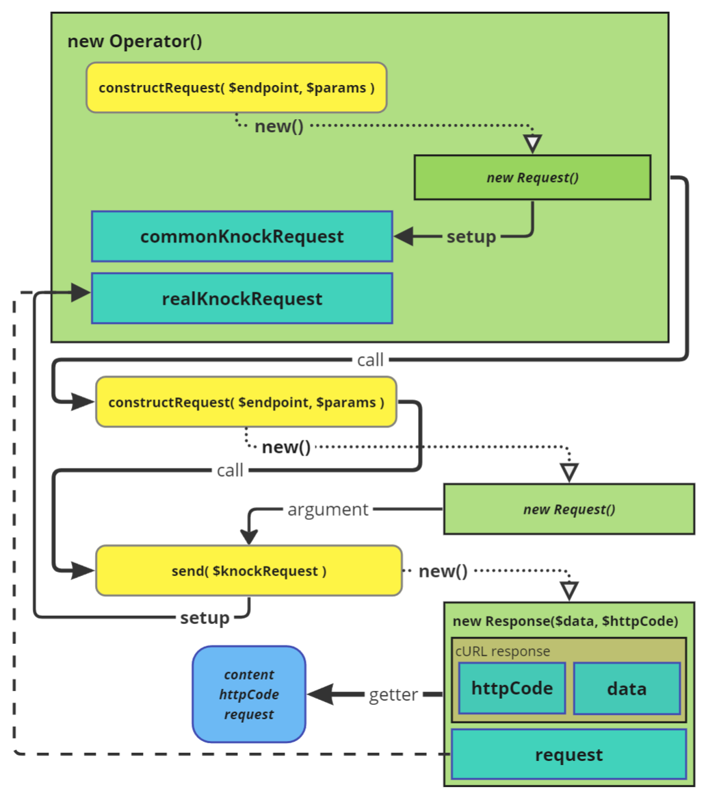

<h1 align="center">KnockKnock</h1>

<p align="center"></p>

KnockKnock - это простая библиотека, реализующая Фасад и предоставляющая удобный интерфейс для выполнения запросов в PHP,
используя расширение cURL.  Она упрощает работу, предоставляя более высокоуровневый API и быстрый доступ к настройкам.

Цель: сделать простой и лёгкий в настройке компонента и запроса пакет.

P.S. я знаю про существование таких библиотек как: [Guzzle](https://github.com/guzzle/guzzle), [Client](https://github.com/yiisoft/yii2-httpclient) _(в моём любимом Yii2)_, но хотелось попробовать создать свою реализацию.  
Без "лишних" данных, вызовов и настроек, nullWarningStyle - только то, что нужно: сухо, лаконично, минималистично.  
_Разумеется, это не конкурент, а просто попытка создать что-то своё_

### Содержание:

 - [Установка](#knockknock-setup)
 - - Требования

___

<h2 align="center"> <span id="knockknock-setup"></span>
    Установка
</h2>


<h3>Требования</h3> <span id="knockknock-setup-require"></span>

- php 8.0
- ext cURL
- ext JSON


<h3>
    <a href="https://getcomposer.org/download/">Composer</a>
</h3> <span id="knockknock-setup-composer"></span>

## Добавление пакета в проект

<h3>Используя: консольные команды. <i>(Предпочтительней)</i></h3><span id="knockknock-setup-composer-cli"></span>

- при composer, установленном локально:
```bash
composer require andy87/KnockKnock
````  
- при использовании composer.phar:
```bash
php composer.phar require andy87/KnockKnock
```
**Далее:** обновление зависимостей `composer update`


<h3>Используя: файл `composer.json`</h3><span id="knockknock-setup-composer-composer-json"></span>

Открыть файл `composer.json`  
В раздел, ключ `require` добавить строку  
`"andy87/knockknock": ">=1.0.0"`  
**Далее:** обновление зависимостей `composer update`


<p align="center">- - - - -</p>


<h2>Используя: подключение авто загрузчика</h2><span id="knockknock-setup-composer-autoload"></span>

В месте, где необходимо использовать библиотеку, подключите авто загрузчик:
```php
require_once 'путь/к/корню/проекта/autoload.php';

```
**Примечания:**
- Убедитесь, что путь к autoload.php правильный и соответствует структуре вашего проекта.


<p align="center">- - - - -</p>

___


<h2>Логика работы библиотеки (блок-схема)</h2> <span id="knockknock-logic-schema"></span>

<p align="center">
    
</p>

### Простой пример работы.

```php
use andy87\knock_knock\lib\Method;
use andy87\knock_knock\lib\ContentType;
use andy87\knock_knock\core\Operator;
use andy87\knock_knock\core\Response;

// Получаем компонент реализующий отправку запросов
$operator = new Operator( $_ENV['API_HOST'] )->disableSSL();  

/**
 * Краткая форма записи (с не очевидным объектом запроса) 
 */
$content = $operator->send( $operator->constructRequest(Method::GET, 'info/me') )->content;

/** 
 * Детальная форма записи с дополнительными возможностями
 */
$request = $operator->constructRequest(Method::GET, 'info/me'); // Создаём объект запроса
$request->setCurlInfo([ CURLINFO_CONTENT_TYPE ]); // Назначаем опции cURL
$response = $operator->send($request); // Отправляем запрос и получаем ответ

$content = $response->content; // Получаем данные ответа
$curlOptions = $response->request->curlOptions; // Получаем опции cURL

$output = ( $curlOptions[CURLINFO_CONTENT_TYPE] === ContentType::JSON ) ? json_decode( $content ) : $content;

print_r( $output );

```


<p align="center">- - - - -</p>

___


<h2 align="center">Базовый класс</h2> <span id="knockknock-src-Operator"></span>

_use [andy87\knock_knock\core\Operator](src/core/Operator.php);_  

PHP Фасад\Адаптер для отправки запросов через ext cURL

<h3>ReadOnly свойства:</h3> <span id="knockknock-src-Operator-readonly"></span>

- **commonRequest** 
  - _Объект содержащий параметры, назначаемые всем исходящим запросам_
- **realRequest** 
  - _Используемый запрос_
- **eventHandlers** 
  - _Список обработчиков событий_
- **host** 
  - _Хост, на который будет отправляться запросы_
- **logs** 
  - _Список логов_

Возможности/фичи:
 - Настройки параметров запросов
 - Защита данных от перезаписи
 - Обработчики событий
 - Инкапсуляция
 - Singleton
 - логирование
  
#### ВАЖНЫЙ МОМЕНТ!  
- В классах применяется инкапсуляция, поэтому для доступа к свойствам компонентов используются ReadOnly свойства.  
- `CURL_OPTIONS` по умолчанию пустые! В большинстве случаев, для получения валидных ответов, требуется задать необходимые настройки.   


<h2 align="center">"Получение" объекта/экземпляра класса</h2> <span id="knockknock-src-Operator-construct"></span>

Передавая параметры напрямую в конструктор:
```php
$operator = new Operator( $_ENV['API_HOST'], $commonRequestParams );
``` 
Применяя, паттерн Singleton:
```php
$operator = Operator::getInstance( $_ENV['API_HOST'], $commonRequestParams );
```
Методы возвращают объект(экземпляр класса `Operator`), принимая на вход два аргумента:
- `string $host` - хост
- `array $operatorConfig` - массив с настройками для всех исходящих запросов.

При создании объекта `Operator` будет вызван метод `init()`, который запускает пользовательские инструкции.  
После выполнения `init()` запускается обработчик события привязанный к ключу `EVENT_AFTER_CONSTRUCT`

<h2 align="center" id="knockknock-src-Operator-params">
  Общие настройки запросов
</h2>
Что бы указать настройки применяемые ко всем исходящим запросам,  
при создании объекта `Operator` передаётся массив (ключ - значение), с необходимыми настройками.

Пример настройки:
```php
// настройки для последующих исходящих запросов
$commonRequestParams = [
    Request::SETUP_PROTOCO => $_ENV['API_PROTOCOL'],
    Request::SETUP_CONTENT_TYPE => Request::CONTENT_TYPE_JSON,
    Request::SETUP_CURL_OPTIONS => [
        CURLOPT_HEADER => false,
        CURLOPT_RETURNTRANSFER => true
    ]
];
// Получаем компонент для отправки запросов
$operator = new Operator( $_ENV['API_HOST'], $commonRequestParams );

//Применяя, паттерн Singleton:
$operator = Operator::getInstance( $_ENV['API_HOST'], $commonRequestParams );
```
Доступные ключи для настройки(константы класса `Request`):

- `SETUP_PROTOCOL`
- `SETUP_HOST`
- `SETUP_METHOD`
- `SETUP_HEADERS`
- `SETUP_CONTENT_TYPE`
- `SETUP_DATA`
- `SETUP_CURL_OPTIONS`
- `SETUP_CURL_INFO`


<h2>Обработчики событий</h2> <span id="knockknock-src-events-setupEventHandlers"></span>

<h3>Список событий</h3> <span id="knockknock-src-events-list"></span>

- `EVENT_AFTER_CONSTRUCT` после создания объекта knockKnock
- `EVENT_CREATE_REQUEST` после создания объекта запроса
- `EVENT_BEFORE_SEND` перед отправкой запроса
- `EVENT_CURL_Operator` перед отправкой curl запроса
- `EVENT_CREATE_RESPONSE` после создания объекта ответа
- `EVENT_AFTER_SEND` после получения ответа

<h5>Пример установки обработчиков событий</h5> <span id="knockknock-src-Handler-events-example"></span>

```php
$operator->setupEventHandlers([
    Operator::EVENT_AFTER_CONSTRUCT => function( Operator $operator ) {
        // ...
    },
    Operator::EVENT_CREATE_REQUEST => function( Operator $operator, Request $request ) {
        // ...
    },
    Operator::EVENT_BEFORE_SEND => function( Operator $operator, Request $request ) {
        // ...
    },
    Operator::EVENT_CURL_HANDLER => function( Operator $operator, resource $ch ) {
        // ...
    },
    Operator::EVENT_CREATE_RESPONSE => function( Operator $operator, Response $response ) {
        // ...
    },
    Operator::EVENT_AFTER_SEND => function( Operator $operator, Response $response ) {
        // ...
    }
]);
```
Первый аргумент - ключ события, второй - callback функция.

Все callback функции принимают первым аргументом объект/экземпляр класса `Operaotr`.  
Вторым аргументом передаётся объект/экземпляр класса в зависимости от события:
- `Request` - для событий `EVENT_CREATE_REQUEST`, `EVENT_BEFORE_SEND`
- `Response` - для событий `EVENT_CREATE_RESPONSE`, `EVENT_AFTER_SEND`


<p align="center">- - - - -</p>

___


<h1 align="center">Запрос</h1>

_use [andy87\knock_knock\core\Request](src/core/Request.php);_  

Объект запроса, содержащий данные для отправки запроса.

<h3>ReadOnly свойства:</h3> <span id="knockknock-src-Request-readonly"></span>

- **protocol** - _протокол_
- **host** - _хост_
- **endpoint** - _конечная точка_
- **method** - _метод_
- **headers** - _заголовки_
- **contentType** - _тип контента_
- **data** - _данные_
- **curlOptions** - _опции cURL_
- **curlInfo** - _информация cURL_
- **params** - _параметры запроса_
- **url** - _полный URL_
- **params** - _все свойства в виде массива_

<h3 align="center">Создание объекта запроса</h3> <span id="knockknock-src-Request-construct"></span>

Передавая параметры напрямую в конструктор:
```php
$request = new Request( 'info/me', [
    Request::METHOD => Method::POST,
    Request::DATA => [ 'client_id' => 34 ],
    Request::HEADERS => [ 'api-secret-key' => $_ENV['API_SECRET_KEY'] ],
    Request::CURL_OPTIONS => [ CURLOPT_TIMEOUT => 10 ],
    Request::CURL_INFO => [
        CURLINFO_CONTENT_TYPE,
        CURLINFO_HEADER_SIZE,
        CURLINFO_TOTAL_TIME
    ],
    Request::CONTENT_TYPE => ContentType::FORM_DATA,
]);
```
Методом, который вызывает _callback_ функцию, привязанную к ключу `EVENT_CREATE_REQUEST`
```php
$request = $operator->constructRequest(Method::GET, 'info/me', [
    Request::METHOD => Method::POST,
    Request::DATA => [ 'client_id' => 45 ],
    Request::HEADERS => [ 'api-secret-key' => $_ENV['API_SECRET_KEY'] ],
    Request::CURL_OPTIONS => [ CURLOPT_TIMEOUT => 10 ],
    Request::CURL_INFO => [
        CURLINFO_CONTENT_TYPE,
        CURLINFO_HEADER_SIZE,
        CURLINFO_TOTAL_TIME
    ],
    Request::CONTENT_TYPE => ContentType::FORM_DATA,
]);
```
Клонируя существующий объект запроса:
```php
$request = $operator->constructRequest(Method::GET, 'info/me');

$response = $operator->send($request);

//Клонирование объекта запроса (без статуса отправки)
$cloneRequest = $request->clone();

// Отправка клона запроса
$response = $operator->setupRequest( $cloneRequest )->send();
```

<h3>
    Назначение/Изменение/Получение отдельных параметров запроса (set/get)
</h3> <span id="knockknock-src-Request-setter-getter"></span>

Таблица set/get методов для взаимодействия с отдельными свойствами запроса

| Параметр        | Сеттер                                | Геттер                   | Информация                                                                                                                                                                    |
|-----------------|---------------------------------------|--------------------------|-------------------------------------------------------------------------------------------------------------------------------------------------------------------------------|
| Протокол        | setProtocol( string $protocol )       | getProtocol(): string    | <a href="https://curl.se/docs/protdocs.html" target="_blank">протоколы</a>                                                                                                    |
| Хост            | setHost( string $host )               | getHost(): string        | ---                                                                                                                                                                           |
| Endpoint        | setEndpoint( string $url )            | getEndpoint(): string    | ---                                                                                                                                                                           |
| Метод           | setMethod( string $method )           | getMethod(): string      | <a href="https://developer.mozilla.org/en-US/docs/Web/HTTP/Methods" target="_blank">методы</a>                                                                                |
| Заголовки       | setHeaders( array $headers )          | getHeaders(): array      | <a href="https://ru.wikipedia.org/wiki/%D0%A1%D0%BF%D0%B8%D1%81%D0%BE%D0%BA_%D0%B7%D0%B0%D0%B3%D0%BE%D0%BB%D0%BE%D0%B2%D0%BA%D0%BE%D0%B2_HTTP" target="_blank">заголовки</a>  |
| Тип контента    | setContentType( string $contentType ) | getContentType(): string | <a href="https://ru.wikipedia.org/wiki/%D0%A1%D0%BF%D0%B8%D1%81%D0%BE%D0%BA_MIME-%D1%82%D0%B8%D0%BF%D0%BE%D0%B2" target="_blank">Тип контента</a>                             |
| Данные          | setData( mixed $data )                | getData(): mixed         | ---                                                                                                                                                                           |
| Опции cURL      | setCurlOptions( array $curlOptions )  | getCurlOptions(): array  | <a href="https://www.php.net/manual/ru/function.curl-setopt.php" target="_blank">Опции cURL</a>                                                                               |
| Информация cURL | setCurlInfo( array $curlInfo )        | getCurlInfo(): array     | <a href="https://www.php.net/manual/ru/function.curl-getinfo.php" target="_blank">Информация cURL</a>                                                                         |

```php
$request = $operator->constructRequest(Method::GET, 'info/me');

$request->setMethod( Method::GET );
$request->setData(['client_id' => 67]);
$request->setHeaders(['api-secret-key' => 'secretKey67']);
$request->setCurlOptions([
    CURLOPT_TIMEOUT => 10,
    CURLOPT_RETURNTRANSFER => true
]);
$request->setCurlInfo([
    CURLINFO_CONTENT_TYPE,
    CURLINFO_HEADER_SIZE,
    CURLINFO_TOTAL_TIME
]);
$request->setContentType( ContentType::JSON );

$protocol = $request->getPrococol(); // String
$host = $request->getHost(); // String
// ... аналогичным образом доступны и другие подобные методы для получения свойств запроса
```
<h3>Назначение запроса с переназначением свойств</h3> <span id="knockknock-src-Request-setupRequest"></span>

```php
$operator->setupRequest( $request, [
    Request::SETUP_HOST => $_ENV['API_HOST'],
    Request::SETUP_HEADERS => [
        'api-secret' => $_ENV['API_SECRET_KEY']
    ],
]);
```
`setupRequest( Request $request, array $options = [] ): self`


<p align="center">- - - - -</p>

___


<h1 align="center">Ответ</h1>

_use [andy87\knock_knock\core\Response](src/core/Response.php);_  

Объект ответа, содержащий данные ответа на запрос.
<h3>ReadOnly свойства</h3> <span id="knockknock-src-Response-readonly"></span>

- **content**
  - _данные ответа_
- **httpCode**
  - _код ответа_
- **request**
  - _объект запроса, содержащий данные о запросе_
- **curlOptions**
  - _быстрый доступ к request->curlOptions_
- **curlInfo**
  - _быстрый доступ к request->curlInfo_

<h3 align="center">Создание объекта ответа</h3> <span id="knockknock-src-Response-construct"></span>

Передавая параметры напрямую в конструктор:
```php
$response = new Response('{"id" => 806034, "name" => "and_y87"}', 200 );
```
Методом, который вызывает _callback_ функцию, привязанную к ключу `EVENT_CREATE_RESPONSE`
```php
$response = $operator->constructResponse([
    Response::CONTENT => [
        'id' => 806034,
        'name' => 'and_y87'
    ],
    Response::HTTP_CODE => 400,
], $request );
```
`constructResponse( array $responseParams, ?Request $request = null ): Response`

<h2>Отправка запроса</h2> <span id="knockknock-src-Handler-send"></span>

`send( array $kafeResponse = [] ): Response`  
Метод требует наличие объекта запроса установленного методом `setupRequest( Request $request )`.  

Вызов метода `send()`, возвращает объект/экземпляр класса `Response`.  
Срабатывает callback функция, привязанная к ключу:
 - `EVENT_AFTER_SEND`
 - `EVENT_CREATE_RESPONSE`
 - `EVENT_BEFORE_SEND`
 - `EVENT_CURL_HANDLER`

```php
// "Долгий путь"
$operator = new Handler( $_ENV['API_HOST'] );
$request = $operator->constructRequest(Method::GET, 'info/me');
$response = $operator->send($request);

// "Короткий путь"
$operator = new Handler( $_ENV['API_HOST'] );
$response = $operator->send( $operator->constructRequest(Method::GET, 'info/me') );
```
Нельзя повторно отправить запрос, выбрасывается `RequestCompleteException`.
Для повторной отправки запроса, необходимо создать новый:
```php
$operator = new Handler( $_ENV['API_HOST'] );
$request = $operator->constructRequest(Method::GET, 'info/me');
$response = $operator->send($request);

// повторная отправка запроса
$response = $operator->send($request->clone());
```

<h2>Отправка запроса с фэйковым ответом</h2> <span id="knockknock-src-Handler-fakeResponse"></span>

Получение подготовленного(фэйкового) ответа
```php
// параметры возвращаемого ответа
$fakeResponse = [
    Response::HTTP_CODE => 200,
    Response::CONTENT => '{"id" => 8060345, "nickName" => "and_y87"}'
];
$request->setFakeResponse( $fakeResponse );

$response = $operator->send( $request );
```
объект `$response` будет содержать в свойствах `content`, `httpCode` данные переданные в аргументе `$fakeResponse`

<h2>Данные в ответе</h2> <span id="knockknock-src-Response-setter"></span>

В созданный объект `Response`, чей запрос не был отправлен, разрешено задавать данные, используя методы группы `set`.  
```php
$response = $operator->send($request);

$response
    ->setHttpCode(200)
    ->setContent('{"id" => 8060345, "nickName" => "and_y87"}');
```
**Внимание!** Если данные в объекте уже существуют, повторно задать их нельзя выбрасывается `ParamUpdateException`.  
В случае необходимости заменить данные, используется вызов метода `replace( string $key, mixed $value )` см. далее

<h3 id="knockknock-src-Response-replace">
    Подмена данных
</h3> <span></span>
Это сделано для явного действия, когда необходимо заменить данные в объекте `Response`.

```php
$response = $operator->send($request);

$response
    ->replace( Response::HTTP_CODE, 200 )
    ->replace( Response::CONTENT, '{"id" => 8060345, "nickName" => "and_y87"}' );
```

<h2>Данные запроса из ответа</h2> <span id="knockknock-src-Response-request"></span>

Для получения из объекта `Response` данных запроса, необходимо обратиться к ReadOnly свойству `request`  
и далее взаимодействовать с ним аналогично объекту `Request`    
```php
$operator = new Handler( $_ENV['API_HOST'] );
$response = $operator->setRequest( $operator->constructRequest(Method::GET, 'info/me') )->send();

// Получение компонента запроса
$request = $response->request;

$method = $request->method; // получение метода запроса
```

Получения свойств cURL запроса 
```php
$operator = new Handler( $_ENV['API_HOST'] );
$response = $operator->setRequest( $operator->constructRequest(Method::GET, 'info/me') )->send();

$response->request;

// Получение свойств через объект запроса
$curlOptions =  $response->request->curlOption;
$curlInfo =  $response->request->curlInfo;

//Вариант с использованием быстрого доступа
$curlOptions =  $response->curlOption;
$curlInfo =  $response->curlInfo;
```
<h3>asArray()</h3> <span id="knockknock-src-Response-asArray"></span>

Преобразование в массив.  
 - преобразование данных ответа на запрос `asArray()`
 - преобразование всего объекта в массив `asArray(true)`
```php
$response = $operator->send($request)->asArray(); // $response
$array = $response->content; // Array$response
```


<p align="center">- - - - -</p>

___

<p align="center">- - - - -</p>


<h1 align="center" >
    Функциональная часть
</h1> <span id="knockknock-src-feature"></span>

<h3>SSL</h3> <span id="knockknock-src-ssl"></span>

Функционал включения/отключения SSL верификации в объектах `Operaotr` & `Request`.  

В `curlOptions` добавляется ключ `CURLOPT_SSL_VERIFYPEER` и `CURLOPT_SSL_VERIFYHOST`.

`->disableSSL( bool $verifyPeer = false, int $verifyHost = 0 );`  
`->enableSSL( bool $verifyPeer = true, int $verifyHost = 2 );`  

`Operaotr` - для всех запросов
```php
$operator = new Handler( $_ENV['API_HOST'] );
$operator->disableSSL();

$request = $operator->constructRequest(Method::GET, 'info/me');

$response = $operator->setupRequest( $request )->send();
```

`Request` - для конкретного запроса  
```php
$operator = new Handler( $_ENV['API_HOST'] )->disableSSL();

$request = $operator->constructRequest(Method::GET, 'info/me');
$request->enableSSL();

$response = $operator->setupRequest( $request )->send();
```
<h3>Cookie</h3> <span id="knockknock-src-Cookie"></span>

В объекте `Operaotr` имеется функционал использования cookie.  
`Operaotr` - для всех запросов  
```php
$operator = new Handler( $_ENV['API_HOST'] );

$cookie = $_ENV['COOKIE'];
$jar = $_ENV['COOKIE_JAR'];

$operator->useCookie( $cookie, $jar );
```  
`$operator->useCookie( string $cookie, string $jar, ?string $file = null )`  
по умолчанию `$file = null` и  `$file` приравнивается к `$jar`  

<h3>Логирование</h3> <span id="knockknock-src-logs"></span>

Добавление сообщений в свойство `->logs` 

```php
$operator = new Handler( $_ENV['API_HOST'] );

$$message = 'Какое то сообщение';

$operator->addLog( $message );
```
`$operator->addLog( string $message )`  


<p align="center">- - - - -</p>

___

<p align="center">- - - - -</p>


<h1 align="center" id="knockknock-extends">Расширения на основе базового класса</h1>

<h3 align="center">
    <a href="docs/KnockKnock/KnockKnockOctopus.md" target="_blank">
        KnockKnockOctopus
        <br>
        
    </a>
</h3> <span id="knockknock-Octopus"></span>

Класс с функционалом простой реализации отправки запросов и минимальными настройками

<h4>Доступные методы.</h4> <span id="knockknock-Octopus-methods"></span>

| get() | post() | put() | patch() | delete() | head() | options() | trace() |
|-------|--------|-------|---------|----------|--------|-----------|---------|

<h4>Каждый метод принимает два аргумента:</h4> <span id="knockknock-Octopus-methods-args"></span>

| Аргумент  |   Тип   | Обязательный  | Описание                       |
|:----------|:-------:|:-------------:|:-------------------------------|
| $endpoint | string  |      Да       | URL запроса (без хоста)        |
| $params   |  array  |      Нет      | Данные запроса в виде массива  |
_P.S. host задаётся в конструкторе_

<h4>Простой пример использования</h4> <span id="knockknock-Octopus-methods-example"></span>

```php
//GET запрос
$knockKnockOctopus->get( '/profile', [ 'id' => 806034 ] );

//POST запрос
$knockKnockOctopus->post( '/new', [ 
    'name' => 'Новая новость',
    'content' => 'Текст новости' 
]);
```


<p align="center"> - - - - - </p>

<h3 align="center">
    <a href="docs/KnockKnock/KnockKnockSecurity.md" target="_blank">
        KnockKnockSecurity
        <br>
        
    </a>
</h3> <span id="knockknock-security"></span>

Расширяет класс [KnockKnockOctopus](docs/KnockKnock/KnockKnockOctopus.md), предоставляя доступ к функционалу для простой и  
быстрой реализации авторизации, и настройки запросов.

```php
$knockKnockSecurity = new KnockKnockSecurity($_ENV['API_URL']);

// Настройка параметров запроса по умолчанию
$knockKnockSecurity
    ->disableSSL()
    ->setupAuthorization( KnockKnockSecurity::TOKEN_BEARER, 'token' )
    ->setupHeaders([ 'X-Api-Key' => $_ENV['X_API_KEY'] ])
    ->setupContentType( ContentType::JSON )
    ->on( Handler::EVENT_AFTER_SEND, function( Handler $operator, Response $response ) => 
    {
        $logFilePath = $_SERVER['DOCUMENT_ROOT'] . '/api_log.txt';

        file_put_contents( $logFilePath, $response->content, FILE_APPEND );
    });

// Получение ответа на запрос методом `patch`
$responsePatch = $knockKnockSecurity->patch( 'product', [
    'price' => 1000
]);

$product = $responsePatch->asArray();

$price = $product['price'];

// Изменение типа контента на `application/json`, для следующего запроса
$knockKnockSecurity->useContentType( ContentType::JSON );

// Отправка POST запроса и получение ответа
$responsePost = $knockKnockSecurity->post( 'category', [
    'name' => 'Фреймворки'
]);

$response = json_decode( $responsePost->content );

$category_id = $response->id;

```


<p align="center">- - - - -</p>

___

<p align="center">- - - - -</p>


<h1>
    Custom реализация
</h1> <span id="knockknock-Custom"></span>

Custom реализация Базового класса, к примеру с добавлением логирования работающим "под капотом"
```php
class KnockKnockYandex extends Handler
{
    private const LOGGER = 'logger';


    private string $host = 'https://api.yandex.ru/'

    private string $contentType = ContentType::JSON

    private YandexLogger $logger;


    /**
     * @return void
     */
    public function init(): void
    {
        $this->setupYandexLoggerEventHandlers();
    }
    
    /**
     * @param array $callbacks
     * 
     * @return self
     */
    private function setupYandexLoggerEventHandlers( array $callbacks ): self
    {
        $this->on( self::AFTER_CREATE_REQUEST, function( Request $request ) => 
        {
            $logData = $this->getLogDataByRequest( $request );

            $this->addYandexLog( $logData );
        };

        $this->on(self::EVENT_AFTER_SEND, function( Response $response ) => 
        {
            $logData = $this->getLogDataByRequest( $response->request );

            $this->addYandexLog( $logData );
        };
    }

    /**
      * @param Request $request
      * 
      * @return array
      */
    private function getLogDataByRequest( Request $request ): array
    {
        return $request->getParams();
    }

    /**
     * @param array $logData
     * 
     * @return void
     */
    private function addYandexLog( array $logData ): bool
    {
        return $logger->log( $logData );
    }
}

```
<h3>
    Пример использования custom реализации
</h3> <span id="knockknock-Custom-use"></span>

```php

$knockKnockYandex = KnockKnockYandex::getInstanсe( $_ENV['API_HOST'], [
    KnockKnockYandex::LOGGER => new YandexLogger(),
]);

$response = $knockKnockYandex->setupRequest( 'profile', [ 
    Request::METHOD => Method::PATCH,
    Request::DATA => [ 'city' => 'Moscow' ],
]); // Логирование `afterCreateRequest`

$response = $knockKnockYandex->send(); // Логирование `afterSend`
```


<p align="center">- - - - -</p>

___

<p align="center">- - - - -</p>


<h2>
    Тесты
</h2> <span id="knockknock-tests"></span>

 - tests: 100+
 - assertions: 350+

<h3>
    Запуск тестов:
</h3> <span id="knockknock-tests-run"></span>

Нативный  
```bash
vendor/bin/phpunit
```  
Информационный  
```bash
vendor/bin/phpunit --testdox
```  
С логированием  
```bash
vendor/bin/phpunit --log-junit "tests/logs/phpunit.xml"
```

<h2>
    Лицензия
</h2> <span id="knockknock-license"></span>

https://github.com/andy87/KnockKnock под лицензией CC BY-SA 4.0  
Для получения дополнительной информации смотрите http://creativecommons.org/licenses/by-sa/4.0/  
Свободно для не коммерческого использования  
С указанием авторства для коммерческого использования  

<h2>
    Изменения
</h2> <span id="knockknock-changelog"></span>

Для получения полной информации смотрите [CHANGELOG](docs/CHANGELOG.md)

<h3>
    Последние изменения
</h3> <span id="knockknock-changes"></span>

24/05/2024 - 99b  
26/05/2024 - v1.0.0  
25/05/2024 - v1.0.1  
{today}/05/2024 - v1.0.2  

[Packagist](https://packagist.org/packages/andy87/knockknock)
