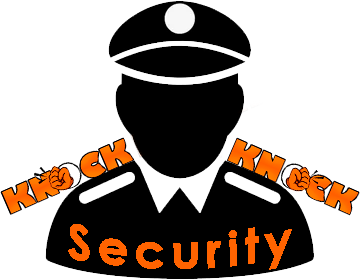

# KnockKnockSecurity
_[andy87\knock_knock\KnockKnockSecurity](../../src/KnockKnockSecurity.php);_

PHP Фасад для класса `KnockKnock` отправляющего запросы через ext cURL.

<p style="text-align: center"></p>

Расширяет класс [KnockKnockOctopus](KnockKnockOctopus.md) и предоставляет доступ к функционалу для простой и  
быстрой реализации авторизации и настройки запросов.

На данный момент реализованы методы:
- setupAuthorization()
- setupHeaders()
- setupContentType()
- useContentType()
- useHeaders()

Эти методы, используя внутренний функционал `KnockKnock`, задают настройки для всех запросов,  
которые будут отправляться этот компонент.  

___

### setupAuthorization()
Метод устанавливает авторизацию для всех запросов, которые будут отправляться этим компонентом.  
Добавляя в заголовки запроса авторизационные данные `Authorization`

#### Пример использования
```php
$KnockKnock = new KnockKnockSecurity('https://api.example.com');
$KnockKnock->setupAuthorization( KnockKnockSecurity::TOKEN_BEARER, 'token' );
```

### setupHeaders()
Метод устанавливает заголовки для всех запросов, которые будут отправляться этим компонентом.

#### Пример использования
```php
$KnockKnock = new KnockKnockSecurity('https://api.example.com')
    ->setupHeaders( [ 'X-Api-Key' => $_ENV['X_API_KEY'] ] );
```

### setupContentType()
Метод устанавливает тип контента для всех запросов, которые будут отправляться этим компонентом.

#### Пример использования

```php
$KnockKnock = new KnockKnockSecurity('https://api.example.com')
    ->setupContentType( LibKnockContentType::JSON );
```

___

### useContentType()
Метод устанавливает тип контента для текущего запроса.  
После выполнения запроса эти параметры не будут применяться к следующему запросу.

#### Пример использования

```php
$KnockKnock = new KnockKnockSecurity('https://api.example.com',[
    KnockRequest::SETUP_CONTENT_TYPE => LibKnockContentType::JSON
]);

// выполнили первый запрос c типом контента JSON
$KnockResponseWithContentTypeJSON_1 = $KnockKnock->get( '/product' );

// Установили тип контента для следующего запроса FORM
$KnockResponseWithContentTypeForm = $KnockKnock
    ->useContentType( LibKnockContentType::FORM )
    ->post('/product', [ 
        'name' => 'Product name' 
    ]);

// следующий запрос будет с типом контента JSON
$KnockResponseWithContentTypeJSON_2 = $KnockKnock->get( '/product' );
```

### useHeaders()
Метод устанавливает заголовки для текущего запроса.
После выполнения запроса эти параметры не будут применяться к следующему запросу.

#### Пример использования

```php
$KnockKnock = new KnockKnockSecurity('https://api.example.com',[
    KnockRequest::SETUP_HEADERS => [
        'X-Api-Key' => $_ENV['X_API_KEY']
    ]
]);

// выполнили первый запрос c заголовком X-Api-Key = `headers from construct`
$KnockResponseWithInitHeaders = $KnockKnock->get( '/product' );

// Установили заголовок для следующего запроса X-Api-Key
$KnockKnock->useHeaders( [ 'X-Api-Key' => 'headers from real time' ] );

// запрос будет с заголовком X-Api-Key = `headers from real time`
$KnockResponseWithRealTimeHeaders = $KnockKnock->post('/product', [ 
        'name' => 'Product name' 
    ]);

```

___


Для установки необходимых параметров запроса каждый из этих методов  
можно использовать вместе вызывая их последовательно цепочкой вызовов.  

```php
$knockKnockSecurity = new KnockKnockSecurity('https://api.example.com');

// Настройка параметров запроса по умолчанию
$knockKnockSecurity
    ->setupAuthorization( 'token', KnockKnockSecurity::TOKEN_BEARER )
    ->setupHeaders( [ 'X-Api-Key' => $_ENV['X_API_KEY'] ] )
    ->setupContentType( LibKnockContentType::JSON );
```

Наследование от `KnockKnock` позволяет использовать все методы для настроек запроса.  
Пример использования:
```php
$knockKnockSecurity
    ->disableSSL()
    ->setupAuthorization( 'token', KnockKnockSecurity::TOKEN_BEARER )
    ->setupHeaders( [ 'X-Api-Key' => $_ENV['X_API_KEY'] ] )
    ->setupContentType( 'application/json' )
    ->on( KnockKnock::EVENT_AFTER_SEND, fn( KnockKnock $knockKnock, KnockResponse $knockResponse ) => 
    {
        $logFilePath = $_SERVER['DOCUMENT_ROOT'] . '/api_log.txt';

        file_put_contents( $logFilePath, $knockResponse->content, FILE_APPEND );
    });


$KnockResponsePatch = $knockKnockSecurity->patch( 'product', [
    'price' => 1000
]);

$product = json_decode( $KnockResponsePatch->content, true );

$price = $product->price;

$knockKnockSecurity->useContentType( LibKnockContentType::JSON );
$KnockResponsePost = $knockKnockSecurity->post( 'category', [
    'name' => 'Фреймворки'
]);

$category_id = $KnockResponse_Post->content['id'];

```

---
> ## 🚧 Альфа версия
> Возможно наличие багов
---